# Embeddings

**The core task** is to compare different submissions in terms of similar parts. To achieve this, a good vector representation is required, e.g. vector embeddings that stress intrinsic similarities between tokens.

The examples of such similarities are:

- distances in a parse tree
- same types of tokens (e.g *type*, *string_literal*)

## Data

- **20** top tasks from Project_CodeNet C++ dataset, each containing **10000** submissions
- **1126888** unique path-contexts
- **78616** of them are found in 10000 submissions for a problem "p02658".
- all the terminals are treated by value except of "identifiers" and hashed
- **7998** unique hashed values of terminals
- **tokenization**: path from root to token in a parse tree, hereinafter *path-context*
- **preprocessing**: path-contexts with path < 5 were removed to avoid large amount of useless preproc. stmts, e.g $\#define$ s

**Underlying hypothesis**: path-contexts with similar prefixes (e.g. sequence of nodes starting from the root) have close embeddings.

## Word2Vec

Word2Vec is a prediction-based method that *learns word vectors by teaching them to predict contexts*.

*Learned parameters*: embeddings. More information is given [here](https://lena-voita.github.io/nlp_course/word_embeddings.html#w2v_idea).

### Hyperparameters

Word2Vec has many hyperparameters but the most important are:

- **vector_size**: Dimensionality of the word vectors. According to [Efficient Estimation of Word Representations in Vector Space](https://arxiv.org/pdf/1301.3781) paper, vector dimensionality depends on amount of the training data, but ~300 is widely used. *384* was chosen.
- **window** : Maximum distance between the current and predicted word within a sentence. According to [A Primer on Neural Network Models for Natural Language Processing](https://arxiv.org/pdf/1510.00726) paper, larger windows tend to produce more topical similarities, while smaller windows tend to produce more functional and syntactic similarities. Grid search: [**5**, **10**, **15**, **20**]
- **min_count**: ignores all words with total frequency lower than this. **1** was chosen, because path-contexts have been processed already.
- sg = **1** (Skipgram)
- hs = **0** (Negative sampling)
- **negative**: how many “noise words” should be drawn. Grid search: [**5**, **10**, **15**, **20**]
- **ns_exponent**:  The exponent used to shape the negative sampling. **0.75** was chosen based on [Distributed Representations of Words and Phrases and their Compositionality](https://arxiv.org/pdf/1310.4546)
- **alpha** : the initial learning rate. **0.03**
- **min_alpha** :  Learning rate will linearly drop to min_alpha as training progresses. **alpha / epochs**
- **seed** : Seed for the random number generator. **42**
- **sample** : The threshold for configuring which higher-frequency words are randomly downsampled. **6e-5** is set.
- **epochs** - Grid search: [**5**, **10**, **15**, **20**]

### Experiments

To visualize and analyze the obtained embeddings, 2 dimensionality reduction techniques were used:

- [**TSNE**](https://distill.pub/2016/misread-tsne/) - for intrinsic evaluation
- [**UMAP**](https://pair-code.github.io/understanding-umap/) - to reveal the global structure

**Metric of comparison**: cosine similarity

### Intrinsic structure

1. embeddings form *rope-like clusters*, they are mostly one point wide:
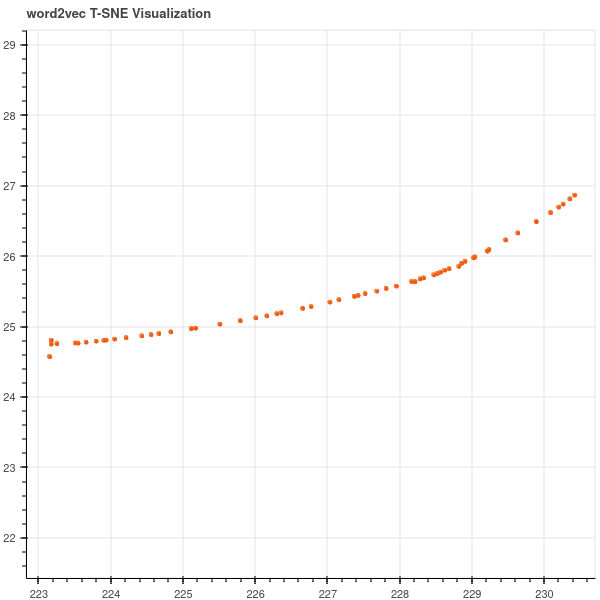
2. some of them are almost rings:
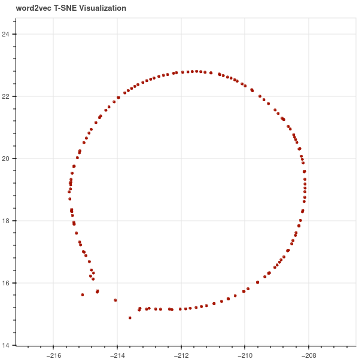
3. just for fun :)
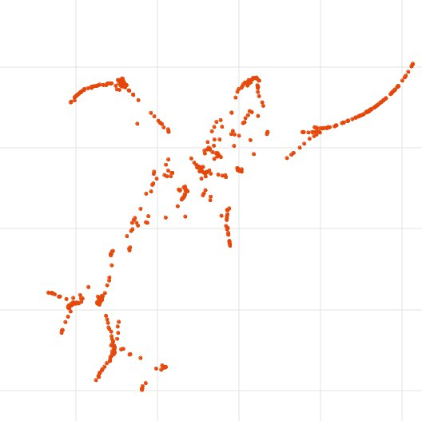
4. each rope is some branch: every *point* in a rope is a root2terminal path, and *sequence* of points follow the *order of tokens* in a program

For example,
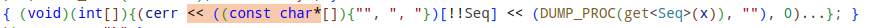
is
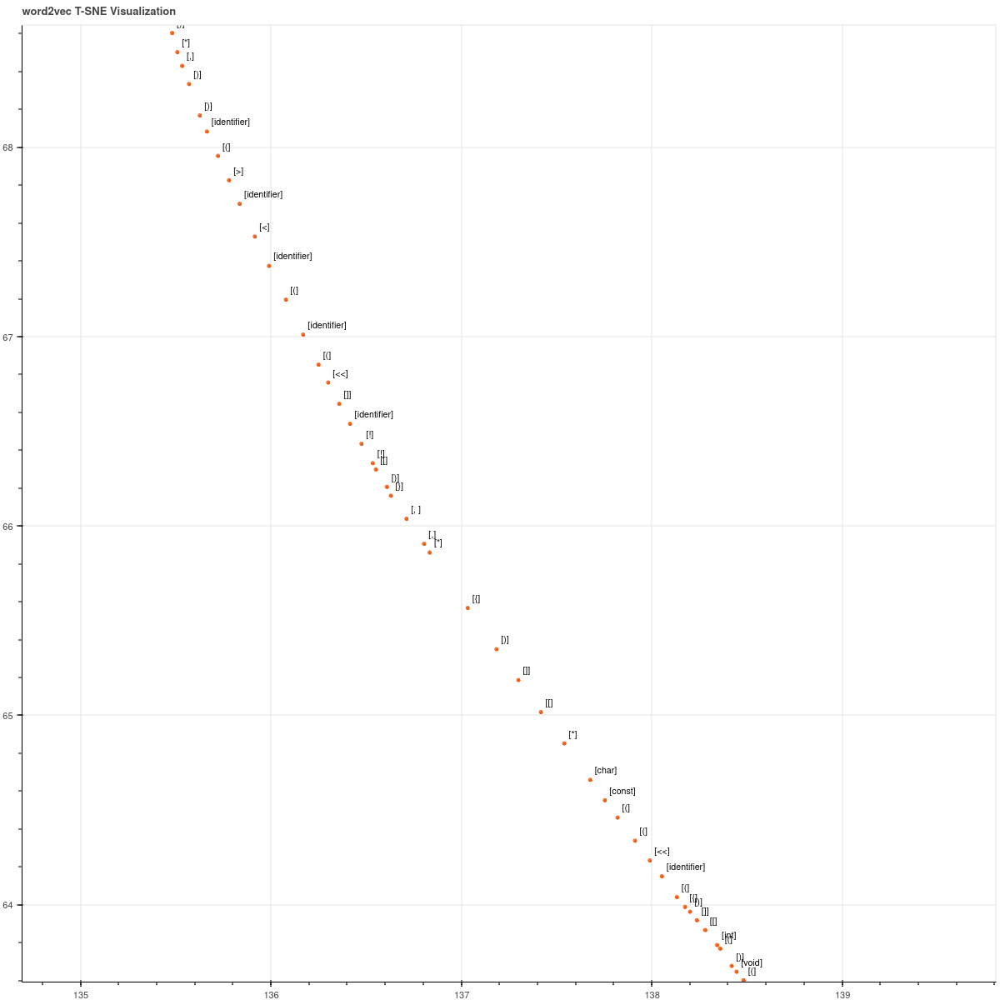
and
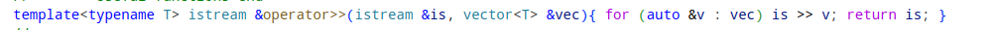
is
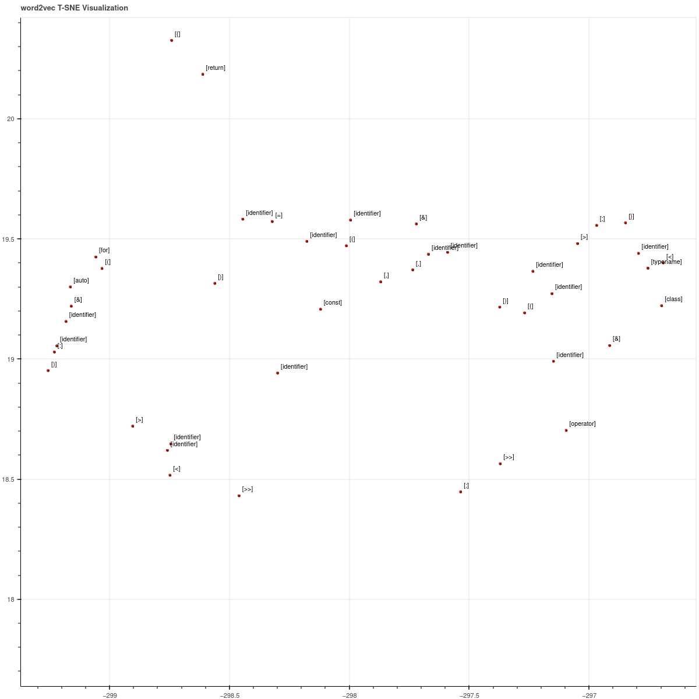

### Global structure

1. branches ("ropes") with similar prefixes tend to group together into large clusters:

    - *TSNE*

    - Same for *UMAP*:
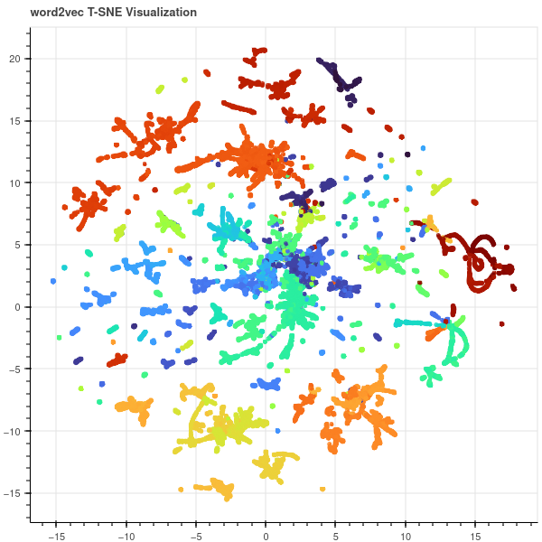

    In these pictures embeddings are assigned colors based on prefixes of the corresponding path-contexts, that is common first nodes in parse trees.

    For example:
    - *yellow* clusters represent *structs*
    - *orange* clusters are *classes*
    - *green*, *blue* and their variations clusters are *functions*
    - *dark blue* clusters show preproc. stmts
    - *red* are constructor / destructor definitions
    - *vinous* clusters are $typedef$
    - *light red* clusters represent namespaces

Open this [html](imgs/word2vec/UMAP3d.html) to watch it in 3D!
2. Within one big cluster there can be subclasters that represent different types of statements, e.g.:
    - *for* loop
    - *while* loop
    - *binary* stmt
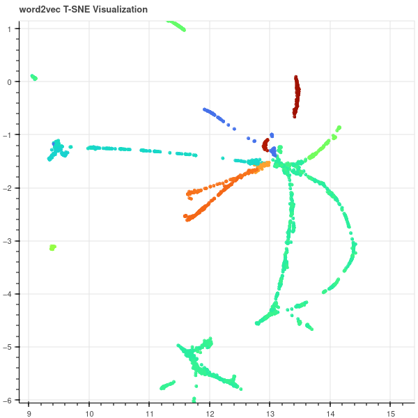

### Hyperparameter evaluation

1. *Negative sampling* param almost doesn't affect the clusters
2. *epochs*
    - 5 is too small, clusters are less accurate
    - 10 is OK in terms of training time and quality
3. *Window size*:
    - with less window sizes clusters are more fuzzy:
        - window = 5

        *An area*:
        

        *The same area*:
        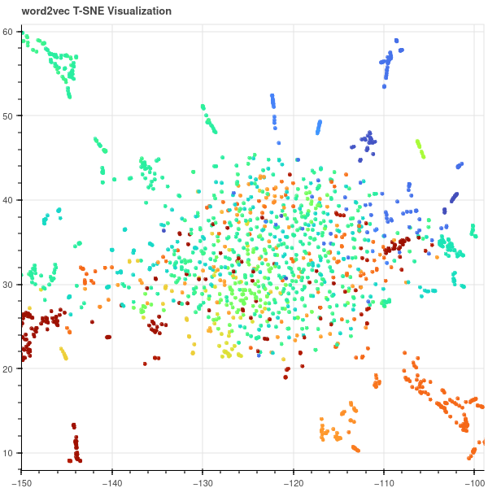

    - after some threshold the quality of cluster partitioning stops improving:
        - window = 15

        *An area*:
        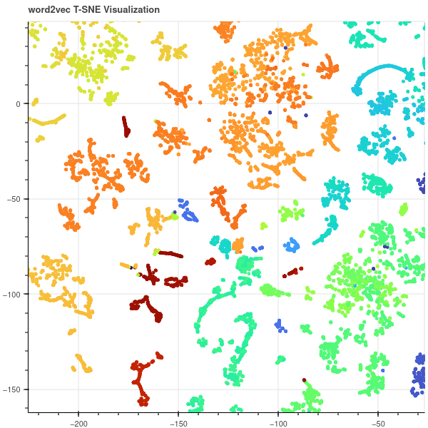

        - window = 20

        *The same area*:
        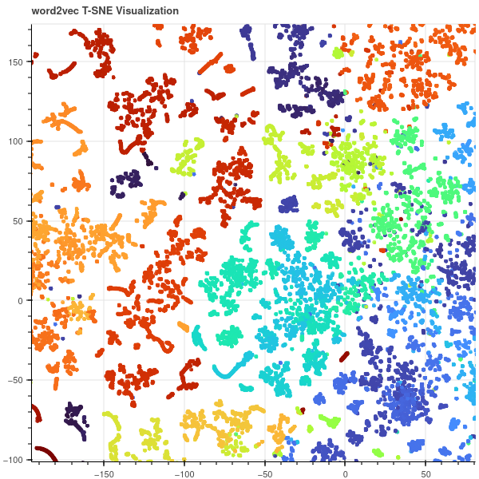

The ring example depending on window size:

- window = 5
    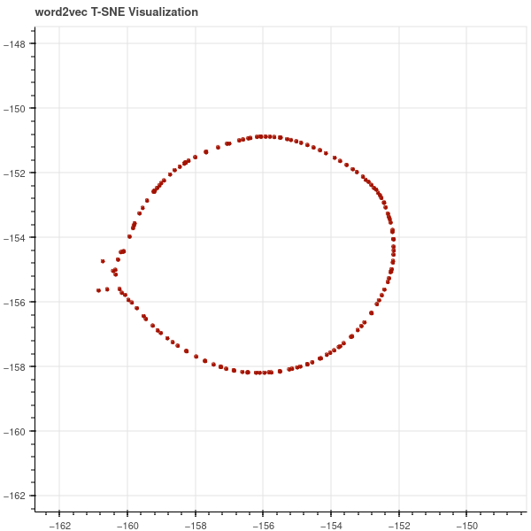
- window = 10
    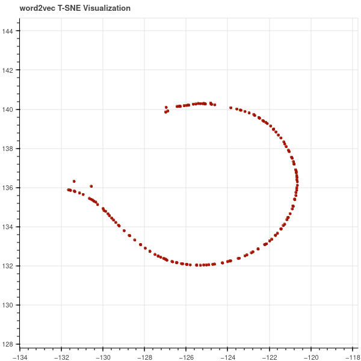
- window = 15
    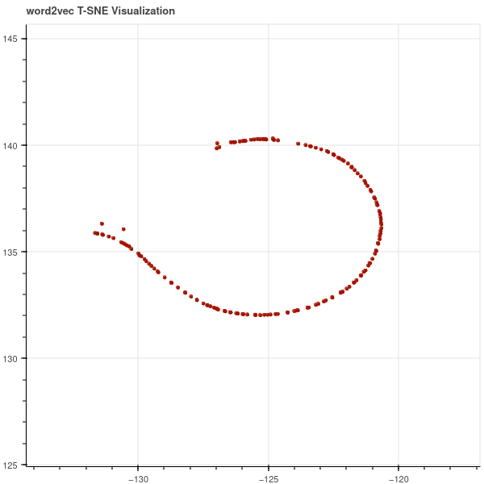
- window = 20
    

### Clustering

Due to obtained cluster shapes it seems that *density-based* clustering algorithms, e.g. *DBSCAN*, *OPTICS* or *HDBSCAN*, are most suitable.

1. [DBSCAN](https://scikit-learn.org/1.5/modules/generated/sklearn.cluster.DBSCAN.html#sklearn.cluster.DBSCAN)

    There are two parameters to the algorithm, *min_samples* and *eps*, which define formally what we mean when we say dense.

    **Hypothesis**: $min_samples$ = 2 (in a rope each inner point has 2 neighbours)

    Here DBSCAN was trained on data, referred to problem "p02658" only.

    Parameters: $min\_samples$ = 2, $eps$ = 0.33
    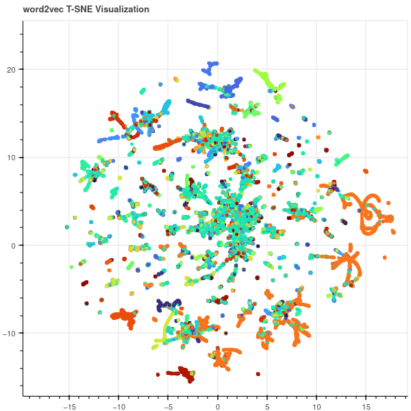

    The azure color means outliers (label = -1)

## Summary

1. The embedding for a path-context "stores" the information about it's surrounding (or *context*)
2. Code distribution is a set of rope-like structures
3. Each rope, a sequence of tokens with a preserved code order, defines the cluster of similarity (e.g. each rope is the maximum "common" cluster of this "type of similarity" among all submissions in dataset).
4. The more data we have, the more precise these ropes-similarities are
5. ropes tend to group together according to the parse tree logic
6. window = 15, negative = 10 are good parameters
7. *density-based* clustering algorithms should be used
